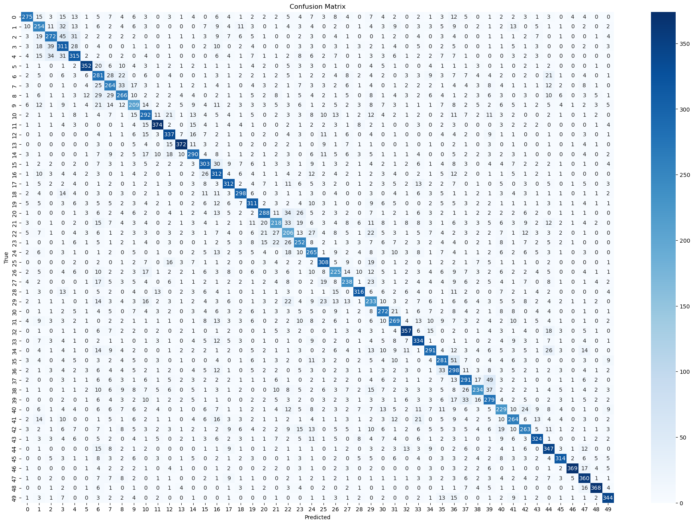
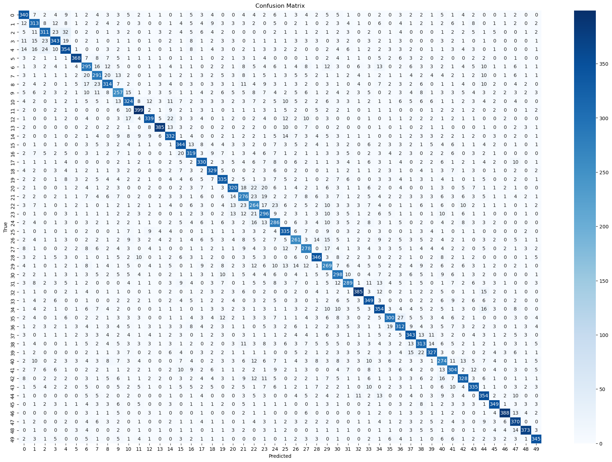

# Best results seen so far


1. Deep network
```json
{
    "input_size": 500,
    "hidden_sizes": [
        2048,
        1024,
        512,
        256,
        128,
        64
    ],
    "output_size": 50,
    "activation": "relu",
    "dropout_rate": 0.2,
    "use_batch_norm": true,
    "learning_rate": 0.001,
    "batch_size": 512,
    "num_epochs": 100,
    "weight_decay": 1e-3,
    "optimizer": "adam",
    "data_dir": "raw",
    "model_dir": "../models",
    "train_file": "train.csv",
    "validation_split": 0.3,
    "random_seed": 23
}
```

With the final stats:
```bash
Final stats:
                loss  accuracy  precision    recall  f1_score
Train       0.630061  0.837480   0.837140  0.837317  0.837182
Validation  1.883898  0.573017   0.584546  0.573482  0.576452
```
Took 17 epochs to train


Can be improved further by using leaky relu and turning off weight decay and using a learning rate of 0.0005 instead

```json
{
    "input_size": 500,
    "hidden_sizes": [
        2048,
        1024,
        512,
        256,
        128,
        64
    ],
    "output_size": 50,
    "activation": "leaky_relu",
    "dropout_rate": 0.2,
    "use_batch_norm": true,
    "learning_rate": 0.0005,
    "batch_size": 512,
    "num_epochs": 100,
    "weight_decay": 0,
    "optimizer": "adam",
    "data_dir": "raw",
    "model_dir": "../models",
    "train_file": "train.csv",
    "validation_split": 0.3,
    "random_seed": 23
}
```

```bash
Final stats:
                loss  accuracy  precision    recall  f1_score
Train       0.479485  0.856989   0.856596  0.856806  0.856665
Validation  1.785360  0.589394   0.596851  0.589923  0.592217
```

Using Gelu can increase the performance slightly to 60%

We noticed that, continuous blocks of classes were getting confused with each other as shown in the following confusion matrix:



```json
{
    "input_size": 500,
    "hidden_sizes": [
        2048,
        1024,
        512,
        256,
        128,
        64
    ],
    "output_size": 50,
    "activation": "gelu",
    "dropout_rate": 0.1,
    "use_batch_norm": true,
    "learning_rate": 0.0005,
    "batch_size": 512,
    "num_epochs": 100,
    "weight_decay": 0,
    "optimizer": "adam",
    "data_dir": "raw",
    "model_dir": "../models",
    "train_file": "train.csv",
    "validation_split": 0.3,
    "random_seed": 23
}
```


We were able to increase the accuracy further by:
- Using layer norm,
- Higher dropout rate, 
- Reducing the number of layers to 4, 
- Using adamw optimizer,
- Cosine annealing for learning rate scheduling,
- Re-introducing weight decay,
- Adding class label smoothing,
- Increasing the train set to 80%

```json
{
    "input_size": 500,
    "hidden_sizes": [
        2048,
        1024,
        512,
        256
    ],
    "output_size": 50,
    "activation": "gelu",
    "dropout_rate": 0.4,
    "label_smoothing": 0.1,
    "use_batch_norm": false,
    "use_layer_norm": true,
    "learning_rate": 0.0005,
    "batch_size": 512,
    "num_epochs": 100,
    "weight_decay": 1e-4,
    "optimizer": "adamw",
    "data_dir": "raw",
    "model_dir": "../models",
    "train_file": "train.csv",
    "validation_split": 0.2,
    "random_seed": 23
}
```

```bash
Final stats:
                loss  accuracy  precision    recall  f1_score
Train       0.908220  0.946460   0.946454  0.946425  0.946430
Validation  1.800581  0.686076   0.691180  0.686954  0.687639
```

We reduced the label smoothing 0.05 but also changed the max num of epochs given to the cosine annealer to be 50% of the max epochs to help learning. This improved the performance a bit more to 70%


```json
{
    "input_size": 500,
    "hidden_sizes": [
        2048,
        1024,
        512,
        256
    ],
    "output_size": 50,
    "activation": "gelu",
    "dropout_rate": 0.4,
    "label_smoothing": 0.05,
    "use_batch_norm": false,
    "use_layer_norm": true,
    "learning_rate": 0.0005,
    "batch_size": 512,
    "num_epochs": 100,
    "weight_decay": 1e-4,
    "optimizer": "adamw",
    "data_dir": "raw",
    "model_dir": "../models",
    "train_file": "train.csv",
    "validation_split": 0.2,
    "random_seed": 23
}
```

```bash
Final stats:
                loss  accuracy  precision    recall  f1_score
Train       0.559781  0.960216   0.960189  0.960182  0.960176
Validation  1.539501  0.700026   0.705220  0.700816  0.701681
```


Tried with decreasing the number of epochs from 100 to 75 instead to allow the scheduler to decay the learning rate smoothly and got similar results

```json
{
    "input_size": 500,
    "hidden_sizes": [
        2048,
        1024,
        512,
        256
    ],
    "output_size": 50,
    "activation": "gelu",
    "dropout_rate": 0.4,
    "label_smoothing": 0.05,
    "use_batch_norm": false,
    "use_layer_norm": true,
    "max_increasing_loss_epochs": 10,
    "learning_rate": 0.0005,
    "batch_size": 512,
    "num_epochs": 75,
    "weight_decay": 1e-4,
    "optimizer": "adamw",
    "data_dir": "raw",
    "model_dir": "../models",
    "train_file": "train.csv",
    "validation_split": 0.2,
    "random_seed": 23
}
```

```bash
Final stats:
                loss  accuracy  precision    recall  f1_score
Train       0.482809  0.980958   0.980954  0.980943  0.980944
Validation  1.570437  0.703838   0.706639  0.704512  0.704889
```

The following image shows the confusion matrix that is better than the issue we were encountering where we had more confusion for continuous classes of objects:




We were able to increase the performance to 75% accuracy by using wider layers which just increased the capacity of the model. We trained for 55 epochs but the best validation loss was achieved at the 45th epoch.


```json
{
    "input_size": 500,
    "hidden_sizes": [
        3072,
        3072,
        2048,
        1536
    ],
    "output_size": 50,
    "activation": "gelu",
    "dropout_rate": 0.4,
    "label_smoothing": 0.05,
    "use_batch_norm": false,
    "use_layer_norm": true,
    "max_increasing_loss_epochs": 10,
    "learning_rate": 0.0005,
    "batch_size": 512,
    "num_epochs": 75,
    "weight_decay": 5e-4,
    "optimizer": "adamw",
    "data_dir": "raw",
    "model_dir": "../models",
    "train_file": "train.csv",
    "validation_split": 0.2,
    "random_seed": 23,
    "scaler": "l2"
}
```

```bash
Final stats:
                loss  accuracy  precision    recall  f1_score
Train       0.410626  0.997650   0.997652  0.997649  0.997650
Validation  1.317940  0.750845   0.752704  0.751579  0.751003
```


Using a shallower model allowed for better generalization

```json
{
    "input_size": 500,
    "hidden_sizes": [
        4096,
        2048
    ],
    "output_size": 50,
    "activation": "gelu",
    "dropout_rate": 0.4,
    "label_smoothing": 0.05,
    "use_batch_norm": false,
    "use_layer_norm": true,
    "max_increasing_loss_epochs": 10,
    "learning_rate": 0.0005,
    "batch_size": 512,
    "num_epochs": 75,
    "weight_decay": 5e-4,
    "optimizer": "adamw",
    "data_dir": "raw",
    "model_dir": "../models",
    "train_file": "train.csv",
    "validation_split": 0.2,
    "random_seed": 23,
    "scaler": "l2"
}
```

```bash
Final stats:
                loss  accuracy  precision    recall  f1_score
Train       0.446335  0.999935   0.999935  0.999935  0.999935
Validation  1.230861  0.776016   0.776310  0.776679  0.775601
```


We used a shallower but wider layers even more:

```json
{
    "input_size": 500,
    "hidden_sizes": [
        4096,
        4096
    ],
    "output_size": 50,
    "activation": "gelu",
    "dropout_rate": 0.4,
    "label_smoothing": 0.05,
    "use_batch_norm": false,
    "use_layer_norm": true,
    "max_increasing_loss_epochs": 10,
    "learning_rate": 0.0005,
    "batch_size": 512,
    "num_epochs": 75,
    "weight_decay": 5e-4,
    "optimizer": "adamw",
    "data_dir": "raw",
    "model_dir": "../models",
    "train_file": "train.csv",
    "validation_split": 0.2,
    "random_seed": 23,
    "scaler": "l2"
}
```

```bash
Final stats:
                loss  accuracy  precision    recall  f1_score
Train       0.439614  1.000000   1.000000  1.000000   1.00000
Validation  1.231272  0.780782   0.781609  0.781454   0.78047
```


## Final submissions

I used the following parameters for the first two submissions:

```json
{
    "input_size": 500,
    "hidden_sizes": [
        4096,
        4096
    ],
    "output_size": 50,
    "activation": "gelu",
    "dropout_rate": 0.4,
    "label_smoothing": 0.05,
    "use_batch_norm": false,
    "use_layer_norm": true,
    "max_increasing_loss_epochs": 10,
    "learning_rate": 0.0005,
    "batch_size": 512,
    "num_epochs": 75,
    "weight_decay": 5e-4,
    "optimizer": "adamw",
    "data_dir": "raw",
    "model_dir": "../models",
    "train_file": "train.csv",
    "test_file": "test.csv",
    "test_predictions_file": "../submissions/test_predictions.csv",
    "validation_split": 0.2,
    "random_seed": 23,
    "scaler": "l2"
}
```

I trained the model on the entire train dataset without splitting b/w train and validation. 
I made the following submissions:
1. For the first submission I trained it for 25 epochs and got a score of 0.788.
2. For the second submission, I trained it for 58 epochs which was the number of epochs it took to get the best validation loss when we initially trained it in the split dataset. This time it got a score of 0.813.


Next try to:
1. Experiment with different label smoothing values: Seems that the best is actually to use 0.05
2. Use different scalers
   1. MinMaxScaler: We got slightly worse performance ~69.9% accuracy
   2. L2 Norm: Got to 70% again
   3. Conclusion: Scaling doesn't really affect the performance.
3. Wider layers instead. Tried the following
   1. `"hidden_sizes": [3072, 3072, 2048, 1536]`
   2. `"hidden_sizes": [3072, 3072, 2048, 2048]`
   3. `"hidden_sizes": [4096, 4096, 2048, 2048]`
   4. `"hidden_sizes": [4096, 4096, 2048]`
   5. `"hidden_sizes": [4096, 4096]` (best one, which was also the architecture that was submitted for the first two submissions).
4. Next perform stratified testing 5-fold cross validation as well and average their weights.
   1. We need to train the model we have right on a subset of the data e.g. 80-85% for multiple models e.g. 5 where each model will see some of the dataset that other's haven't. This is similar to Random Forest classifier where we expose only a subset of the dataset to each decision tree and then average the prediction made by each tree for the final prediction. 
5. Try out focal loss
6. Residual connections
